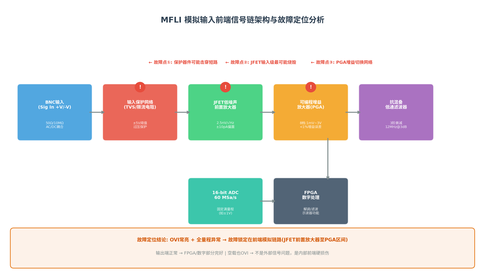
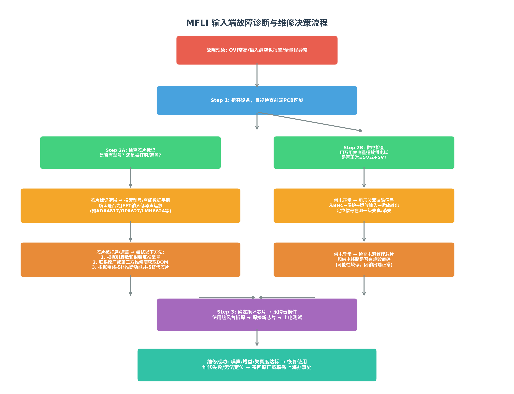

# Zurich Instruments MFLI 锁相放大器输入端烧毁故障分析与自行维修可行性报告

> 归档说明：本文是 2026-06-15 阶段的早期分析报告，部分故障概率判断和器件猜测已被后续测量更新。当前排查基准以 `../repair_status.md` 为准。

## 一、故障现象与定位结论

### 1.1 故障现象汇总

根据您提供的沟通记录，这台MFLI的故障表现可归纳为以下四个核心症状：

| 序号 | 故障现象 | 说明 |
|:---:|:---|:---|
| 1 | **输入悬空仍OVI报警** | BNC完全空载时，点击自动量程后跳转到3V档，仪器和面板指示灯均报告输入超限(OVI)[^5^] |
| 2 | **3V量程下示波器无信号** | 在最高量程下用内置示波器功能观察不到任何有效信号 |
| 3 | **小量程波形异常溢出** | 手动切换到1V量程后OVI灯熄灭，但波形显示超出1V范围，说明信号链已失真 |
| 4 | **输出端完全正常** | Signal Output功能完好，可正常产生正弦波输出，证明FPGA和数字部分无损坏 |

**关键推断**：输出端正常说明仪器的**FPGA数字处理核心、DAC输出链路、电源管理、通信接口**均完好无损[^51^]。故障被严格限定在**模拟输入前端链路**——即从BNC连接器到ADC之间的这段信号路径。

### 1.2 OVI指示灯的本质含义

OVI（Signal Input Overload）是MFLI的前面板红色LED指示灯，其触发条件是**输入信号幅度超过了当前所选量程的上限，导致ADC饱和**[^5^]。正常情况下，当输入悬空（高阻态）时，前端应只检测到极低的热噪声（约nV级），OVI灯不应亮起。您描述的空载即报警现象说明：**前端模拟链路产生了异常的直流偏置或自激振荡**，导致ADC输入端始终处于过驱状态。

从工程师反馈的"**大于5V就烧了**"这一信息来看[^16^]，MFLI的输入保护阈值大约在±5V左右。当外部信号超过此阈值时，内部的TVS二极管或限流电阻会尝试钳位，但如果过压能量过大或持续时间过长，**前端JFET运放的栅极-源极结可能会被击穿**，造成永久性损伤。

---

## 二、MFLI输入前端架构深度解析

### 2.1 信号链整体架构

根据Zurich Instruments官方公开的架构文档[^51^][^52^]，MFLI的模拟输入信号链遵循以下路径：

> **BNC输入 → 输入耦合/阻抗选择网络 → 过压保护电路 → JFET低噪声前置放大器 → 可编程增益放大器(PGA) → 抗混叠低通滤波器 → 16-bit ADC(60 MSa/s) → FPGA数字处理**

这条信号链的设计目标是在DC至5MHz带宽内实现**2.5 nV/√Hz**的超低输入噪声和**120 dB**的动态储备[^52^]。为了达到这一指标，每个环节都经过精心优化，但也意味着任何一级的损坏都会导致整个输入通道失效。

### 2.2 各环节技术细节与故障关联

#### 2.2.1 输入耦合与阻抗选择网络

MFLI的输入阻抗可在**50Ω**和**10MΩ**之间软件切换，同时还支持**AC/DC耦合**选择[^55^]。在10MΩ高阻模式下，输入电容约27~40pF（取决于量程）[^52^]。这一网络通常由继电器或模拟开关（如DG系列）实现。如果模拟开关损坏导致输入对地短路，也可能引起OVI报警，但这种情况下通常会伴随输入阻抗异常，且损坏概率远低于前端运放。

#### 2.2.2 过压保护电路——第一道防线

MFLI的输入保护设计采用了典型的**TVS二极管 + 限流电阻**架构[^16^][^39^]。TVS（瞬态电压抑制器）的击穿电压通常设置在**±5V~±6V**区间，当输入电压超过此阈值时，TVS迅速导通将过流能量泄放到地。限流电阻（通常在100Ω~1kΩ范围）则负责将故障电流限制在运放输入端可承受的范围内（一般≤5mA）[^76^]。

**故障模式分析**：如果过压事件的能量超过了TVS的承受极限，TVS可能被**击穿短路**——这会导致输入端永久性对地低阻，从而产生持续的OVI报警。更常见的情况是TVS成功钳位但限流电阻或前端运放本身被烧毁。

#### 2.2.3 JFET低噪声前置放大器——最脆弱的核心

这是整个输入链中**最关键也最容易损坏**的环节。MFLI的噪声指标（2.5 nV/√Hz电压噪声、±10pA输入偏置电流）强烈暗示前端采用的是**JFET输入结构的超低噪声运算放大器**[^52^][^55^]。这类运放的栅极输入阻抗极高（>10¹²Ω），但栅-源极之间的PN结非常脆弱，**极小的过压电流就足以造成永久性击穿**。

| 候选芯片型号 | 噪声(nV/√Hz) | 输入偏置电流 | 带宽 | 封装 |
|:---:|:---:|:---:|:---:|:---:|
| **ADA4817** (ADI) | 4 | 2 pA | 1.05 GHz | LFCSP-8/SOIC-8 [^47^] |
| **OPA627** (TI) | 5.2 | 2 pA | 16 MHz | SOIC-8/DIP-8 |
| **LMH6624** (TI) | 0.92 | 2 µA | 1.5 GHz | SOT-23-5/SOIC-8 [^36^] |
| **OPA140** (TI) | 5.1 | 10 pA | 11 MHz | SOIC-8 |
| **LTC6240** (ADI) | 7 | 1 pA | 18 MHz | SOT-23-5 |

ADA4817是一款特别值得关注的候选——它采用ADI专有的XFCB工艺，兼具**JFET输入（高阻抗、低偏置电流）和GHz级带宽**， datasheet中明确列出了"Photodiode amplifiers"和"Data acquisition front ends"等应用场景[^50^]，与MFLI的架构高度吻合。Zurich Instruments作为一家追求极致性能的瑞士公司，在其产品中使用ADA4817这类高端器件是非常合理的推测。

#### 2.2.4 可编程增益放大器(PGA)

PGA负责将前端放大后的信号进一步调整到ADC的固定满量程范围（通常为±1V或±2V）[^51^]。MFLI支持8个输入量程（±1mV至±3V），这意味着PGA需要实现约**70 dB（3000倍）的增益调节范围**。PGA通常由多路复用器+电阻网络+缓冲放大器构成，如果增益切换网络中的模拟开关或精密电阻损坏，可能导致增益失控，表现为"切换到1V量程后波形超出范围"的症状。

#### 2.2.5 ADC与后续数字链路

MFLI采用**16位、60 MSa/s**的ADC[^52^]。如果ADC本身损坏，通常会导致完全无信号或数字噪声，而不是持续的OVI报警。考虑到您的设备输出端功能完全正常，**ADC和FPGA部分基本可以排除**。

### 2.3 故障点综合定位

综合以上分析，您的MFLI故障最可能位于以下三个位置之一（按概率排序）：

| 优先级 | 故障部位 | 概率评估 | 对应症状 |
|:---:|:---|:---:|:---|
| **1** | **JFET前置运放输入级烧毁** | **>70%** | 空载OVI、所有量程异常、高输入偏置电流 |
| **2** | **输入保护器件(TVS/限流电阻)击穿** | ~15% | 空载OVI、输入阻抗异常降低 |
| **3** | **PGA增益切换网络损坏** | ~10% | 量程切换异常、增益失控 |
| 4 | ADC或模拟开关 | <5% | 完全无信号或数字噪声 |

---

## 三、芯片打磨问题——事实与对策

### 3.1 Zurich Instruments是否打磨芯片？

这是您关心的核心问题之一。经过多轮搜索，**我未找到Zurich Instruments主动打磨芯片的直接公开证据**。但需要明确以下几点：

**高端仪器厂商的防逆向工程实践**：对于MFLI这类售价超过7000美元[^65^]、核心竞争力在于模拟前端设计的精密仪器，厂商有充分的商业动机保护其IP。常见的防逆向手段包括：

- **芯片丝印磨除或覆盖**：将关键芯片（尤其是前端运放和PGA）的型号标识打磨掉，或用环氧树脂/导热垫遮盖
- **定制ASIC或打标芯片**：向芯片厂商订购带有Zurich Instruments专属丝印的定制版本
- **BGA封装+盲埋孔PCB**：增加PCB抄板难度
- **多层板+内层走线**：关键信号走在内层，外层难以探测

### 3.2 实际拆机检查建议

既然您已经多次拆开过这台MFLI，建议您重点检查以下区域：

**（1）前端PCB区域（靠近BNC连接器）**

打开设备后，找到前面板BNC连接器对应的PCB区域。关注以下几点：

- **芯片表面是否有清晰丝印**：正常芯片会有厂商Logo、型号（如"ADA4817"）、批次号等信息。如果看到表面是**光秃秃的金属或只有模糊痕迹**，说明被打磨了。
- **芯片是否被遮盖**：有些厂商会用黑色导热垫、环氧树脂或金属屏蔽罩覆盖关键芯片。
- **封装类型**：数一下引脚数量。如果是8引脚的小型封装（SOT-23-5、SOIC-8、LFCSP-8），大概率是单/双运放；如果是16引脚以上，可能是多路复用器或仪表放大器。

**（2）根据电路拓扑反推芯片功能**

即使芯片型号不可见，您也可以根据周边电路推断其功能：

- **靠近BNC的第一个有源器件** → 前置放大器（最可能是JFET运放）
- **有多路数字控制线（3~4根）连接的芯片** → PGA或模拟开关
- **靠近ADC的差分输出器件** → ADC驱动器或全差分放大器

### 3.3 芯片不可识别时的替代策略

如果确实发现芯片被打磨或遮盖，不要放弃。以下是几种可行的替代方案：

| 方法 | 具体操作 | 可行性 |
|:---|:---|:---:|
| **引脚反推法** | 根据封装引脚数和外部连接（输入脚接BNC、输出脚接下一级）确定是单运放/双运放/仪表放大器 | 高 |
| **电路功能推断** | 根据周边电阻电容值计算增益，推断是前置放大（G≈1~10）还是PGA（多档增益） | 高 |
| **联系第三方维修商** | 国内有一些专业维修精密仪器的公司，可能有MFLI的维修经验和BOM清单 | 中 |
| **联系原厂索取BOM** | 直接联系Zurich Instruments上海办事处，说明已过保且自行维修，询问是否可以提供前端电路的器件清单（可能需要签署NDA） | 中 |
| **基于性能指标选型替代** | 如果知道该位置是前置JFET放大器，可根据噪声、带宽、输入阻抗指标选择pin-to-pin兼容或功能等效替代品 | 高 |

---

## 四、自行维修完整操作指南

### 4.1 维修前准备

**必备工具**：

| 工具/设备 | 用途 | 备注 |
|:---|:---|:---|
| 热风台（可控温） | 拆焊QFN/LFCSP/SOIC封装芯片 | 温度控制在300~350°C |
| 精密烙铁（尖头） | 焊接引脚、清理焊盘 | 温度可调，建议60W以上 |
| 万用表 | 测量供电电压、通断、二极管压降 | 最好有毫伏档 |
| 示波器（≥100MHz） | 追踪信号通路 | 最小灵敏度≤1mV/div |
| 短接帽（BNC） | 短路输入端进行噪声测试 | Amphenol RF 202114 [^63^] |
| 精密电阻电容套件 | 可能需要更换周边无源器件 | 1%精度 |

**备件采购**：在确定芯片型号前，可以先了解以下候选芯片的供货情况：

- **ADA4817-1ARDZ** (ADI, LFCSP-8) —— 约$5~8/片 [^47^]
- **OPA627AU** (TI, SOIC-8) —— 约$10~15/片
- **LMH6624MF** (TI, SOT-23-5) —— 约$3~5/片 [^36^]

### 4.2 分步诊断流程

#### Step 1: 目视检查（不开机）

拆开设备后，在**良好照明+放大镜**下检查前端PCB区域：

- 是否有**发黑、烧焦、鼓包**的元件？
- 是否有**裂纹或脱焊**的引脚？
- 芯片表面是否有可识别的**丝印标记**？
- 用万用表二极管档测量BNC中心针到地的正反向压降：正常应显示开路（OL），如果显示0.3~0.7V的导通压降，说明TVS或运放输入结已击穿短路。

#### Step 2: 供电检查（开机，不连接信号）

给设备上电，用万用表DC电压档测量前端运放的供电引脚：

- 典型供电可能是**±5V**双电源或**+5V/+3.3V**单电源
- 如果供电异常（如某一路为0V或电压偏低），检查电源管理IC和LC滤波器
- 由于输出端正常，供电异常的概率较低，但仍需确认

#### Step 3: 信号追踪（最关键步骤）

使用示波器从BNC输入端开始，逐级向后追踪信号：

| 测量点 | 预期信号（空载） | 异常表现 | 结论 |
|:---|:---|:---|:---|
| BNC中心针 | 噪声<1mVpp | 有数伏的直流偏置 | 外部干扰或保护器件击穿 |
| 运放输入脚 | 噪声<1mVpp | 有直流偏置或自激振荡 | 运放输入级损坏 |
| 运放输出脚 | 噪声<10mVpp | 输出饱和到电源轨 | 运放本身损坏 |
| PGA输出 | 噪声随量程变化 | 任何量程都饱和 | PGA或运放损坏 |

**关键技巧**：在示波器上开启**AC耦合**和**20MHz带宽限制**，将时基设为1ms/div，垂直灵敏度设为1~10mV/div。正常的前端在空载时只应显示微伏级的热噪声。

#### Step 4: 芯片级确认

如果信号在某一运放处中断或失真，就可以锁定目标芯片。此时：

- 记录芯片的**封装类型、引脚数、外形尺寸**
- 拍摄清晰的**芯片表面照片**（即使被打磨也要记录）
- 绘制该芯片周边的**电阻电容连接关系**（尤其是反馈电阻，可用来计算增益）
- 用万用表测量芯片各引脚对地的直流电压，与典型运放的正常偏置对比

### 4.3 芯片更换操作要点

#### 4.3.1 拆焊技巧

MFLI作为高端仪器，PCB很可能是**多层板（4~6层）**，且焊盘较小。拆焊时务必注意：

- **温度控制**：热风台设为320~350°C，风速中等，先预热PCB区域30秒再对准芯片加热
- **避免过热**：持续加热不超过60秒，防止PCB分层或周边元件脱落
- **保护周边**：用铝箔胶带遮盖待拆芯片周围的敏感元件
- **使用助焊剂**：涂抹适量助焊膏帮助热量传导和焊锡流动

#### 4.3.2 焊接新芯片

- **焊盘清理**：用吸锡带将旧焊盘清理平整，涂少量助焊剂
- **对位**：如果是QFN/LFCSP封装，注意底部散热焊盘（EPAD）也需要焊接
- **温度曲线**：先预热PCB，然后对准芯片吹热风，看到焊锡熔化后轻微用镊子压平
- **检查**：焊接完成后用放大镜检查是否有连锡、虚焊，必要时用电烙铁补焊引脚

### 4.4 维修后验证

更换芯片后，需要进行以下验证测试：

| 测试项目 | 操作方法 | 合格标准 |
|:---|:---|:---|
| **空载噪声测试** | BNC接短接帽，量程设1mV，用Sweeper测噪声谱密度 [^60^][^63^] | < 3.2 nV/√Hz @ >1kHz |
| **OVI指示灯** | 空载状态下观察软件和面板的OVI指示 | 应熄灭 |
| **增益精度** | 输入已知幅度信号（如100mV@1kHz），检查各量程读数 | 误差<1% |
| **失真度** | 输入-1dBFS信号，检查谐波失真 | <-80dBc @ <100kHz |
| **输入偏置电流** | 高阻模式下测量输入端直流偏置 | <±200pA |
| **全量程扫描** | 从1mV到3V逐档切换，确认每档正常工作 | 无溢出、无异常噪声 |

---

## 五、维修可行性综合评估

### 5.1 有利因素

您的背景条件对自行维修非常有利：

- **有锁相放大器前级电路设计经验**（达到SR830水平）—— 这意味着您完全理解JFET输入级、PGA、ADC驱动等核心电路的工作原理
- **多次拆机学习过** —— 对设备内部结构和PCB布局已有直观认识
- **已过保修期** —— 无需担心保修失效问题
- **输出端正常** —— 故障范围被严格限定在前端，不需要处理复杂的FPGA/数字部分

### 5.2 不利因素与风险

| 风险因素 | 具体影响 | 应对策略 |
|:---|:---|:---|
| **芯片被打磨/遮盖** | 无法确定型号，难以采购替换件 | 引脚反推+功能推断+联系原厂 |
| **多层PCB拆焊难度** | 容易烫坏焊盘或周边元件 | 控制温度+预热+使用助焊剂 |
| **前端电路高度集成** | 可能有定制器件或匹配电阻网络 | 仔细测量周边元件值 |
| **维修后指标不达标** | 噪声/失真度无法恢复到原厂水平 | 预留返厂维修的后路 |

### 5.3 成本与时间估算

| 项目 | 自行维修 | 寄回原厂/上海办事处 |
|:---|:---|:---|
| **费用** | 芯片$5~15 + 工具（如有）| 预估￥3000~8000（不含运费）|
| **时间** | 1~3天（含快递等芯片）| 1~2周（含往返物流）|
| **成功率** | 取决于芯片可识别性和焊接技术 | 接近100% |
| **数据/校准** | 需自行重新验证指标 | 原厂会做好全套校准 |

---

## 六、最终建议

基于以上全面分析，我的建议如下：

### 推荐方案：先自行诊断，再决定是否动手维修

1. **立即执行**：拆开设备，用放大镜+万用表检查前端区域，重点确认：
   - 芯片是否有可识别的丝印？
   - BNC到地是否有异常导通？
   - 是否有肉眼可见的烧毁痕迹？

2. **如果能识别芯片型号**：根据型号搜索数据手册，确认功能（是否为JFET运放），采购替换件，执行更换。

3. **如果芯片被打磨但周边电路清晰**：根据引脚连接关系和电阻网络推断芯片类型，选择功能等效替代品（重点关注噪声、带宽、输入阻抗指标）。

4. **如果完全无法识别且电路复杂**：建议先联系Zurich Instruments上海办事处询问维修报价。如果报价过高（>￥5000），再考虑联系国内第三方精密仪器维修商。

### 关于"换芯片就行了吗？"

**大概率是的，但有几个前提**：

- **损坏只限于前端运放**：如果过压事件还波及到了PGA或ADC，维修复杂度会大幅上升
- **能找到正确的替换芯片**：如果芯片被打磨且无法反推型号，会陷入困境
- **焊接技术过关**：QFN/LFCSP封装的拆焊对手工操作有一定要求

您提到之前拆开时没注意看芯片标记，**建议现在立刻重新拆开，用高像素手机拍摄前端区域的清晰照片**（多拍几张不同角度的），然后放大查看芯片表面。这是决定能否自行维修的关键第一步。
